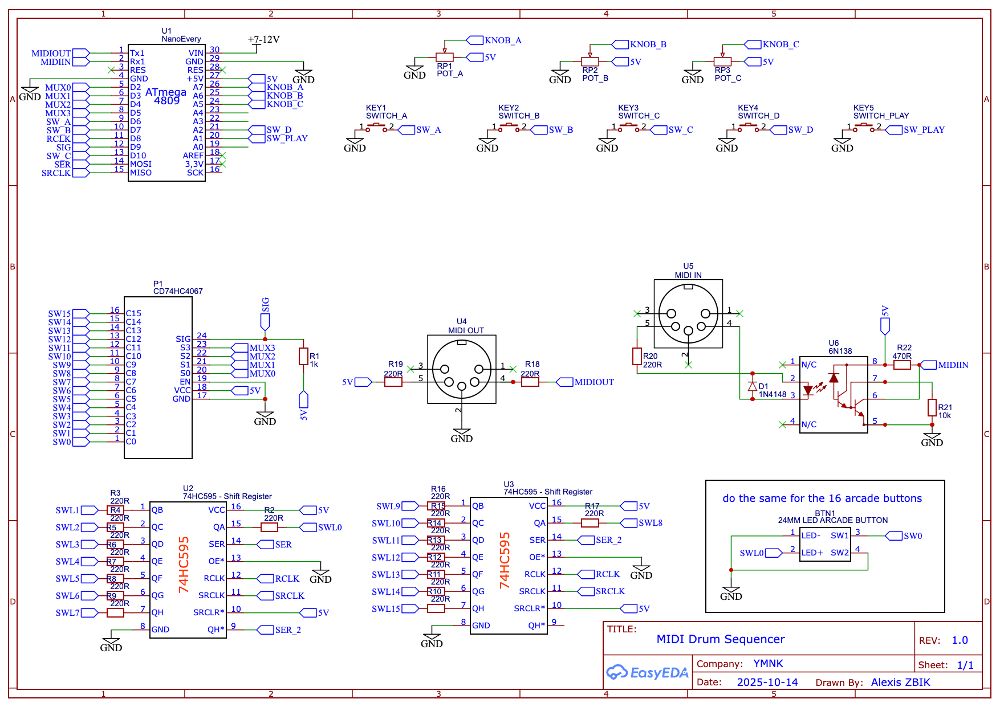

Arduino based MIDI drum sequencer

Schematic :

SWITCH A => select voice

SWITCH B => shift

SWITCH C => select bar count and select current bar

SWITCH D => enable steps

SHIFT + SWITCH A => mute voice

SHIFT + SWITCH C => erase voice

SHIFT + SWITCH D =>

SHIFT + PLAY => when playing, restart the sequence

TEMPO knob => select tempo (between 40 & 230bpm)

GROOVE knob => set shuffle/groove

VELOCITY knob => set the velocity value of the next enabled step

SHIFT + DRUM BUTTON 1 => switch between sequencer mode & perform mode

SHIFT + DRUM BUTTON 2 => enable/disable note repeater for perform mode
